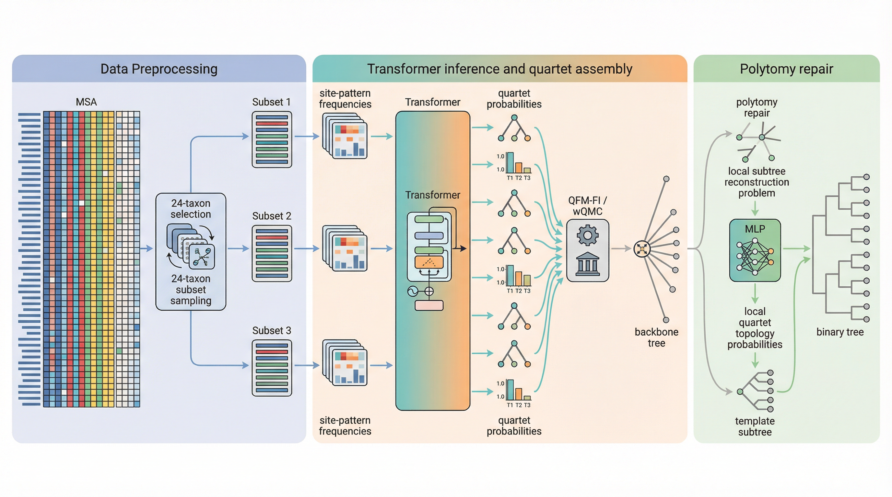

<p align="center">
  
</p>

# QuartFormer

QuartFormer is a fast phylogenetic tree inference framework for genome-scale data.  
It uses deep learning to predict weighted quartets, then assembles quartets and repairs polytomies to produce a final binary tree.

## Why QuartFormer

- **Fast**: On a single GPU, genome-scale datasets with hundreds of taxa can typically be processed in **seconds to tens of seconds** (depending on taxa count, sequence length, and configuration).
- **Low memory footprint**: In our current tests, `1024 taxa + 10 Mbp` runs with **below 4 GB peak GPU memory**.
- **Accurate**: The method shows stable accuracy on both simulated and real datasets. See `docs/results.md` for details.

## Method Overview

QuartFormer follows this pipeline:

1. Sample 24-taxon subsets from the input MSA.
2. Compute site-pattern frequencies, then use a Transformer to predict weighted quartet probabilities for each subset.
3. Feed all weighted quartets into an assembler (QFM-FI / wQMC) to build a backbone tree.
4. Perform local subtree reconstruction at polytomies and use an MLP for topology repair.
5. Output the final binary phylogenetic tree (with optional support computation and plotting).



## Quick Start

```bash
pip install -r requirements.txt

python infer_tree.py \
  --phy examples/24/MSA.phy \
  --out output/example_24.nwk \
  --task-type homogeneous
```

## Documentation

- User manual: `docs/user_manual.md`
- Results and experiments: `docs/results.md`
- Example datasets: `examples/`

## Acknowledgments

QuartFormer implementation, comparisons, and experiments build on or reference the following projects/resources:

- IQ-TREE: https://github.com/iqtree/iqtree2
- RAxMLGrove: https://github.com/angtft/RAxMLGrove
- SimPhy: https://github.com/adamallo/SimPhy
- FastTree: https://github.com/morgannprice/fasttree
- ASTER: https://github.com/chaoszhang/ASTER
- QFM-Java: https://github.com/sharmin-mim/qfm_java
- TREE-QMC: https://github.com/molloy-lab/TREE-QMC
