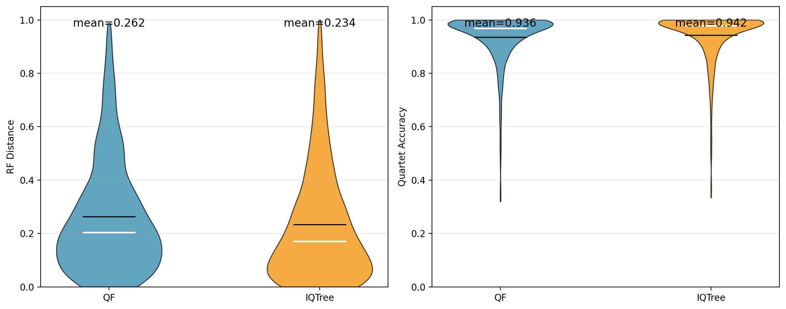
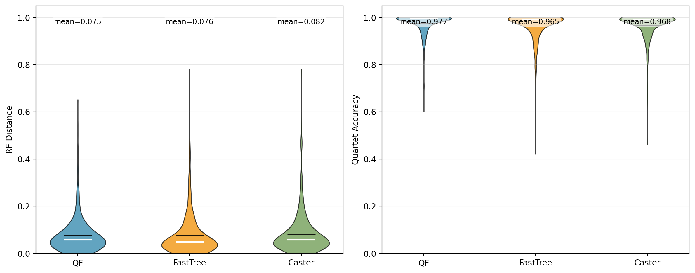
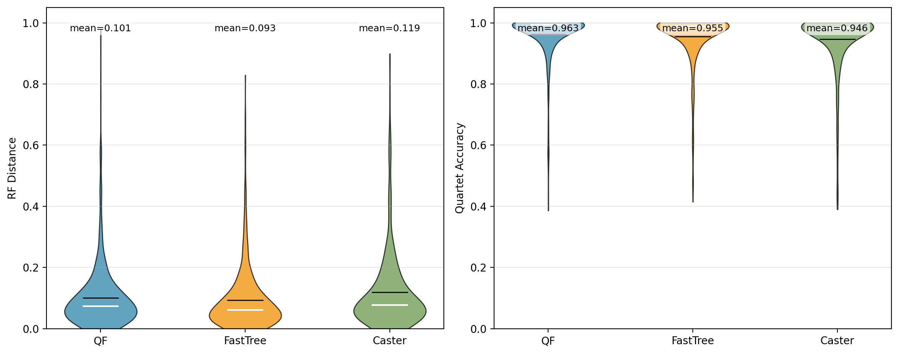

# Accuracy Evaluation

This document summarizes the current accuracy evaluation protocol and reported results for QuartFormer.

## Inference Modes

QuartFormer provides two inference modes in `run_qf.py`:

- `--task-type homogeneous`: sequence evolution is modeled as consistent with a single species-tree history.
- `--task-type heterogeneous`: sequence evolution may be discordant with the species tree (for example, due to ILS, HGT, gene duplication, and gene loss).

These two modes use different model weights trained on different simulation settings.

## Evaluation Metrics

Both simulated and real-data analyses use:

1. **RF distance** between inferred tree and reference species tree (lower is better).
2. **Quartet concordance** between inferred tree and reference species tree (higher is better).

## Modeling Scope Note

In the current release, QuartFormer does not explicitly model insertion/deletion (indel) events carried by gap characters (`-`) as a separate signal.  
Therefore, results should be interpreted as evaluations under the current substitution-pattern-focused modeling setup.

## Simulated Data Benchmarks

We report three simulation experiments.

### Experiment A: Homogeneous setting

- Comparison: QuartFormer vs IQ-TREE
- Data source:
  - Topology/branch and empirical parameters from [RAxMLGrove](https://github.com/angtft/RAxMLGrove)
  - MSA simulated with IQ-TREE `alisim`
- Target: compare inferred trees against the simulation reference species tree.

| Metric | QuartFormer | IQ-TREE |
|---|---:|---:|
| Mean RF distance | 0.262 | 0.234 |
| Mean quartet concordance | 0.936 | 0.942 |

### Experiment B: Heterogeneous setting (ILS only)

- Comparison: QuartFormer vs FastTree vs Caster
- Data source:
  - Species trees and gene trees simulated with [SimPhy](https://github.com/adamallo/SimPhy)
  - Sequence evolution parameters from RAxMLGrove
  - Gene alignments concatenated into a supermatrix for inference
- Inconsistency modeled: ILS.

| Metric | QuartFormer | FastTree | Caster |
|---|---:|---:|---:|
| Mean RF distance | 0.075 | 0.076 | 0.082 |
| Mean quartet concordance | 0.977 | 0.965 | 0.968 |

### Experiment C: Heterogeneous setting (ILS + additional events)

- Comparison: QuartFormer vs FastTree vs Caster
- Data generation uses heterogeneous settings with additional processes such as HGT, gene duplication, and gene loss.
- Sequence evolution parameters are sampled from RAxMLGrove.
- Gene alignments are concatenated into a supermatrix for inference.

| Metric | QuartFormer | FastTree | Caster |
|---|---:|---:|---:|
| Mean RF distance | 0.101 | 0.093 | 0.119 |
| Mean quartet concordance | 0.963 | 0.955 | 0.946 |

## Real-World Dataset Validation

We also evaluate QuartFormer on published real datasets by concatenating available genes into one supermatrix (missing taxa padded with `-`) and then inferring one tree.

Real-data inferred trees are intended for **reference and qualitative comparison only**. Different preprocessing pipelines, filtering strategies, and model assumptions can produce different topologies.

Figures for real-data results are provided in:

- `docs/realistic_result` (Figure 1 to Figure 8)

Included datasets:

1. Wolbachia: *Phylogenomic Analysis of Wolbachia Strains Reveals Patterns of Genome Evolution and Recombination*
2. Insecta (Bembidion): *Phylogenomics of the major lineages of Bembidion and related ground beetles*
3. Oakleaf butterfly: *The evolution and diversification of oakleaf butterflies*
4. Plant (papilionoid legumes): *Highly resolved papilionoid legume phylogeny based on plastid phylogenomics*
5. Fish (Ostariophysan): *Phylogenomic Systematics of Ostariophysan Fishes*
6. Mammal dataset 1: *Genomic evidence reveals a radiation of placental mammals uninterrupted by the KPg boundary*
7. Mammal dataset 2: *Ultraconserved elements improve the resolution of difficult nodes within the rapid radiation of neotropical sigmodontine rodents*
8. Ruminant: *Large-scale ruminant genome sequencing provides insights into their evolution and distinct traits*
