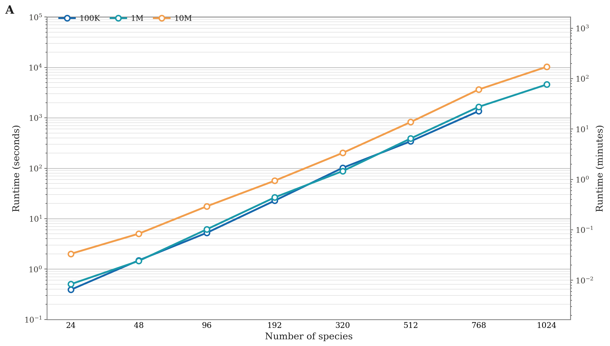
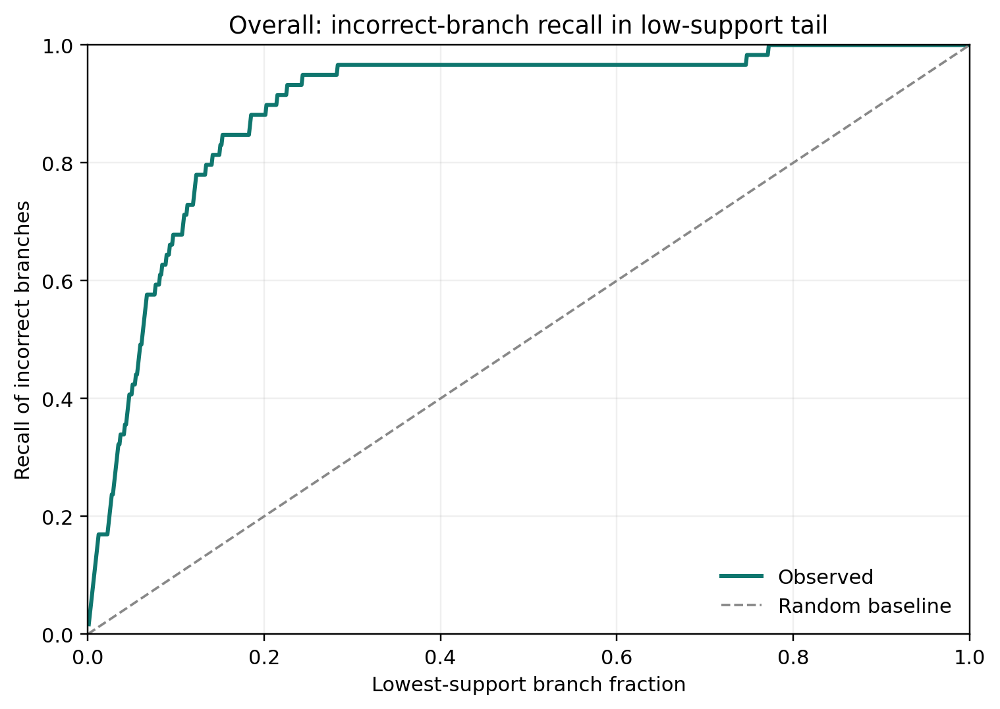

# QuartFormer Results

This document contains two modules:

1. Runtime performance
2. Accuracy results

## 1. Runtime Performance

### 1.1 Runtime Experiment Configuration

- Task type: `homogeneous`
- Inference batch size: `8`
- Branch support computation: `False`
- Replicates per point: `3` (sample `0/1/2`)
- Species counts: `24, 48, 96, 192, 320, 512, 768`
- Sequence lengths: `100,000`, `1,000,000`, `10,000,000` sites
- Config files by taxon range:
- `24~192`: `config_benchmark/24~192.jsonc`
- `320~512`: `config_benchmark/320~512.jsonc`
- `768~1024`: `config_benchmark/768~1024.jsonc`

### 1.2 Runtime Scaling Plot

- X-axis: species count categories with equal spacing.
- Left Y-axis: runtime in seconds (`log10` scale).
- Right Y-axis: runtime in minutes.
- Three lines correspond to sequence lengths (`100K`, `1M`, `10M`).
- Each node value is the mean runtime across the three benchmark samples.

## 2. Accuracy Results

### 2.1 Real-Dataset Comparison

Each cell reports `RF distance (quartet consistency)`.  
Best metric per row is bolded (`RF: lower is better`, `Quartet consistency: higher is better`).
In this section, the source-study tree is treated as a reference tree for formal comparison only, not as absolute phylogenetic truth.

| Reference dataset | QuartFormer (ours) | FastTree | CASTER |
|---|---|---|---|
| Wang 2020 (Wolbachia) | 0.1000 (0.9785) | **0.0000 (1.0000)** | 0.1667 (0.9433) |
| Pflug 2024 (Bembidion) | 0.1860 (0.9417) | **0.1163** (0.9548) | **0.1163 (0.9671)** |
| Wang 2022 (Oakleaf) | 0.0857 (0.9871) | N/A | **0.0286 (0.9991)** |
| Chakrabarty 2017 (Ostariophysan) | **0.0312 (0.9981)** | 0.0625 (0.9977) | 0.1562 (0.9878) |
| Parada 2021 (Sigmodontinae) | 0.0702 (0.9739) | **0.0175 (0.9995)** | 0.1404 (0.9842) |
| Liu 2017 (Placental) | 0.1392 (**0.9522**) | 0.1519 (0.9521) | **0.1392** (0.9392) |
| Foley 2023 (Mammals241) | 0.0378 (0.9947) | **0.0000 (1.0000)** | 0.0126 (0.9947) |
| Choi 2022 (Papilionoid) | 0.0664 (**0.9948**) | **0.0207** (0.9607) | 0.0705 (0.9943) |
| Chen 2019 (Ruminant) | 0.0816 (0.9915) | **0.0000 (1.0000)** | 0.0408 (0.9927) |
| Leebens-Mack 2019 (1KP) | 0.2766 (**0.97538**) | **0.0979** (0.96286) | 0.2613 (0.94918) |
| **Average** | 0.1075 (0.9788) | **0.0519 (0.9809)** | 0.1133 (0.9752) |

Note: the FastTree average is computed on 9 datasets because Oakleaf has `N/A`.
Quartformer_config: config_benchmark/accuracy_test_ml_rf_real.jsonc

Reference methods:

| Reference dataset | Reference method |
|---|---|
| Wang 2020 (Wolbachia) | Concatenation (`RAxML v8.2`) |
| Pflug 2024 (Bembidion) | Concatenation (`IQ-TREE 2.0.3`) |
| Wang 2022 (Oakleaf) | Concatenation (`RAxML`) |
| Chakrabarty 2017 (Ostariophysan) | Concatenation (`RAxML`) |
| Parada 2021 (Sigmodontinae) | Gene-tree summary (`ASTRAL-III` + `IQ-TREE`) |
| Liu 2017 (Placental) | Concatenation + coalescent (`RAxML v8.0.22` + `STAR`/`NJst`) |
| Foley 2023 (Mammals241) | Concatenation + coalescent (`SVDquartets` + source-study concatenation) |
| Choi 2022 (Papilionoid) | Concatenation (`IQ-TREE 1.6.12`) |
| Chen 2019 (Ruminant) | Concatenation (`ExaML`/`RAxML`) |
| Leebens-Mack 2019 (1KP) | Concatenation + coalescent (`ASTRAL-II v5.0.3` + `ExaML`/`RAxML`) |

### 2.2 Support Reliability (from `data/ml_rf_real`)

Here, a branch is treated as "discordant" only in the formal sense that it differs from the chosen reference tree split.

Intuitive summary:

- Total evaluated internal branches: **804**
- Reference-discordant branches (formal): **59** (`7.34%`)
- Mean support of reference-consistent branches: **92.87**
- Mean support of reference-discordant branches: **46.76**
- Support gap (consistent - discordant): **46.10**
- AUC (support of consistent branch > support of discordant branch): **0.929**
- Spearman correlation (support vs consistency label): **0.400**
- Calibration error (ECE): **0.032** (lower is better)
- Low-support tail captures most discordant branches:
- bottom 10% branches capture **67.8%** of all discordant branches
- bottom 20% capture **88.1%**
- bottom 30% capture **96.6%**

Interpretation in plain words: under this formal reference-tree comparison, support can effectively separate relatively certain parts from relatively uncertain parts of the inferred topology.

Per-dataset support reliability snapshot (discordance is defined relative to the reference tree):

| Dataset | Discordant rate | AUC | Support gap | Tail20 recall | Fraction needed to capture all discordant |
|---|---:|---:|---:|---:|---:|
| Bacteria | 0.100 | 0.975 | 46.55 | 1.000 | 0.133 |
| Insecta | 0.186 | 0.843 | 26.37 | 0.500 | 0.419 |
| butterfly | 0.086 | 0.896 | 24.95 | 0.667 | 0.257 |
| fish | 0.031 | 0.935 | 42.66 | 1.000 | 0.094 |
| mammal2 | 0.070 | 0.953 | 37.69 | 1.000 | 0.140 |
| mammal241 | 0.038 | 0.977 | 64.61 | 1.000 | 0.193 |
| mammal82 | 0.139 | 0.799 | 24.33 | 0.545 | 0.810 |
| plant1 | 0.066 | 0.968 | 59.07 | 1.000 | 0.162 |
| ruminant44 | 0.082 | 1.000 | 57.73 | 1.000 | 0.082 |

### 2.3 Dataset Sources

- Wang 2020 (Wolbachia): https://doi.org/10.1093/gbe/evaa235
- Pflug 2024 (Bembidion): https://doi.org/10.1093/isd/ixae025
- Wang 2022 (Oakleaf): https://doi.org/10.1016/j.cell.2022.07.006
- Chakrabarty 2017 (Ostariophysan): https://doi.org/10.1093/sysbio/syx038
- Parada 2021 (Sigmodontinae): https://doi.org/10.1093/sysbio/syab023
- Liu 2017 (Placental): https://doi.org/10.1073/pnas.1616744114
- Foley 2023 (Mammals241): https://doi.org/10.1126/science.abl8189
- Choi 2022 (Papilionoid legumes): https://doi.org/10.3389/fpls.2022.823190
- Chen 2019 (Ruminant): https://doi.org/10.1126/science.aav6202
- Leebens-Mack 2019 (1KP): https://doi.org/10.1038/s41586-019-1693-2
